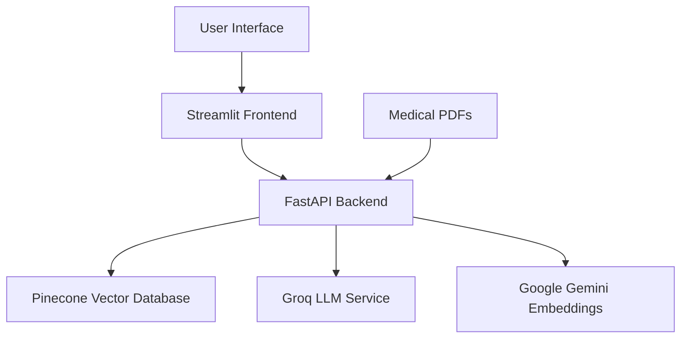

# AI Medical Assistant ChatBot

An intelligent medical assistant chatbot that leverages AI and Large Language Models (LLMs) to help users understand medical documents and answer health-related questions. The system uses Retrieval-Augmented Generation (RAG) to provide accurate, context-based responses from uploaded medical documents.

## 🏥 Project Overview

The AI Medical Assistant ChatBot is designed to:
- Process and analyze medical documents (PDFs)
- Answer health-related questions based on uploaded documents
- Provide accurate, context-aware responses using advanced AI models
- Maintain a secure, scalable architecture using modern technologies

## 🏗️ Architecture



### Components

1. **Frontend**: Streamlit-based web interface for user interaction
2. **Backend**: FastAPI server handling API requests
3. **Vector Database**: Pinecone for storing document embeddings
4. **LLM Service**: Groq's Llama3-70b for natural language processing
5. **Embedding Service**: Google Gemini for document embedding
6. **Storage**: Local file system for uploaded documents

## 🚀 Features

- **Document Upload**: Upload medical PDFs for analysis
- **Question Answering**: Ask questions about uploaded medical documents
- **Context-Aware Responses**: Get answers based on document content
- **Secure API**: Protected endpoints with proper error handling
- **Scalable Architecture**: Cloud-based vector storage for efficient retrieval

## 🧠 AI/ML Components

### Models Used
- **LLM**: Llama3-70b via Groq API
- **Embeddings**: Google Gemini embedding-001 model
- **Vector Store**: Pinecone vector database

### Technologies
- **LangChain**: For LLM integration and prompt management
- **FastAPI**: Backend API framework
- **Streamlit**: Frontend web interface
- **PyPDF**: PDF document parsing

## 📁 Project Structure

```
medicalAssistant/
├── assets/                 # Static assets and documentation
├── client/                 # Streamlit frontend application
│   ├── components/         # UI components (upload, chat, download)
│   ├── utils/              # Utility functions (API communication)
│   ├── config.py           # Configuration settings
│   └── app.py              # Main Streamlit application
├── server/                 # FastAPI backend server
│   ├── modules/            # Core functionality modules
│   ├── routes/             # API endpoint definitions
│   ├── middlewares/        # Error handling middleware
│   ├── main.py             # FastAPI application entry point
│   └── requirements.txt    # Backend dependencies
└── main.py                 # Main application entry point
```

## 🛠️ Setup Instructions

### Prerequisites
- Python 3.8+
- API keys for:
  - Google API Key (for embeddings)
  - Groq API Key (for LLM)
  - Pinecone API Key (for vector database)

### Backend Setup

1. Navigate to the server directory:
   ```bash
   cd medicalAssistant/server
   ```

2. Create a virtual environment:
   ```bash
   python -m venv venv
   source venv/bin/activate  # On Windows: venv\Scripts\activate
   ```

3. Install dependencies:
   ```bash
   pip install -r requirements.txt
   ```

4. Create a `.env` file with your API keys:
   ```env
   GOOGLE_API_KEY=your_google_api_key
   GROQ_API_KEY=your_groq_api_key
   PINECONE_API_KEY=your_pinecone_api_key
   PINECONE_INDEX_NAME=medicalindex
   ```

5. Run the server:
   ```bash
   uvicorn main:app --reload
   ```

### Frontend Setup

1. Navigate to the client directory:
   ```bash
   cd medicalAssistant/client
   ```

2. Install dependencies:
   ```bash
   pip install -r requirements.txt
   ```

3. Update `config.py` with your backend URL:
   ```python
   API_URL="http://127.0.0.1:8000"  # For local development
   # API_URL="https://your-deployment-url.com"  # For production
   ```

4. Run the Streamlit app:
   ```bash
   streamlit run app.py
   ```

## 📖 Usage

1. **Start the Services**:
   - Run the FastAPI backend server
   - Run the Streamlit frontend application

2. **Upload Documents**:
   - Use the upload interface to add medical PDFs
   - Documents are processed and stored in Pinecone

3. **Ask Questions**:
   - Type your medical questions in the chat interface
   - Get context-aware responses based on uploaded documents

4. **View Responses**:
   - See answers with source document references
   - Continue the conversation with follow-up questions

## 🔐 Environment Variables

Create a `.env` file in the server directory with the following variables:

```env
GOOGLE_API_KEY=your_google_api_key
GROQ_API_KEY=your_groq_api_key
PINECONE_API_KEY=your_pinecone_api_key
PINECONE_INDEX_NAME=medicalindex
```

## 🌐 API Endpoints

### POST `/upload_pdfs/`
Upload medical PDF documents for processing and storage.

**Request**: Multipart form data with PDF files
**Response**: Success message or error

### POST `/ask/`
Ask questions about uploaded medical documents.

**Request**: Form data with question text
**Response**: JSON with answer and source information

## 📈 Deployment

The application can be deployed using:
- **Backend**: Render, Heroku, or any cloud platform supporting Python
- **Frontend**: Streamlit Cloud or similar hosting services
- **Vector Database**: Pinecone managed service

## 🤝 Contributing

1. Fork the repository
2. Create a feature branch
3. Commit your changes
4. Push to the branch
5. Create a pull request

## 📄 License

This project is licensed under the MIT License - see the [LICENSE](LICENSE) file for details.

## 📧 Contact

For questions or collaboration opportunities, please reach out via GitHub issues or contact the repository owner directly.